# Let's fly

Questo progetto è una web app che simula un gestionale per la prenotazione dei voli 

## Descrizione

Questo progetto è realizzato attraverso l'utilizzo di diverse tecnologie quali html, css, javascript, bootstrap, spring, jpa

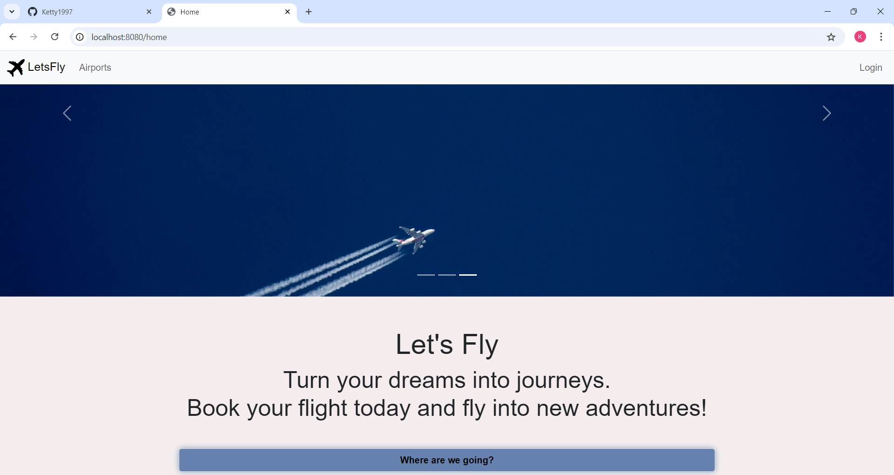
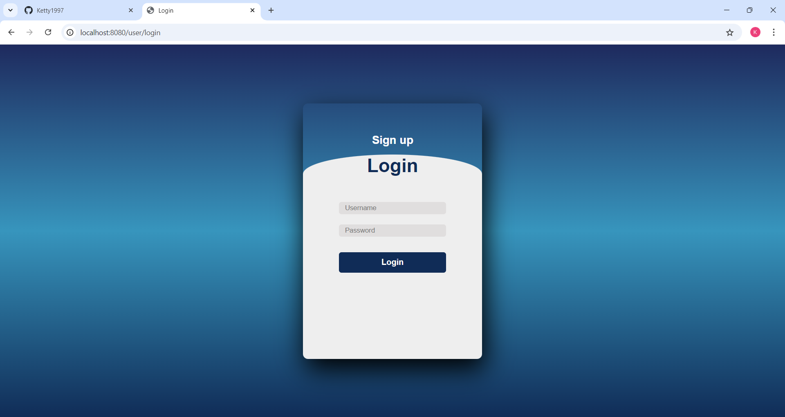
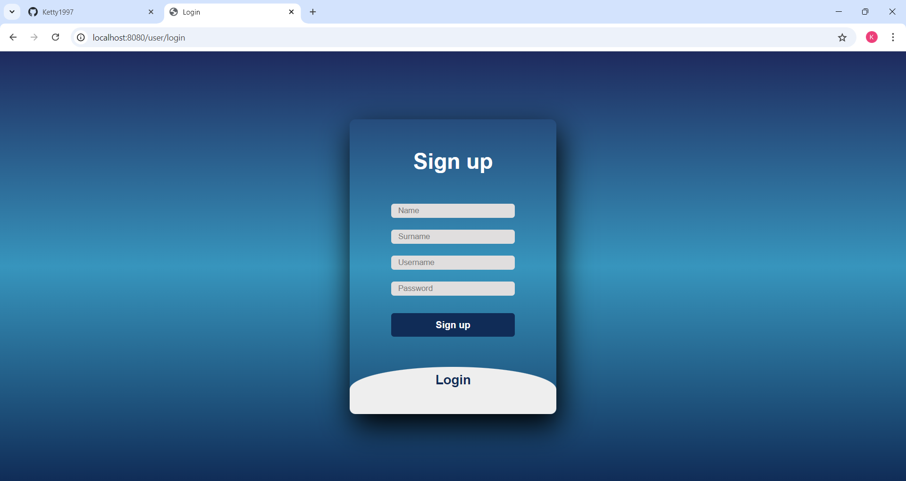
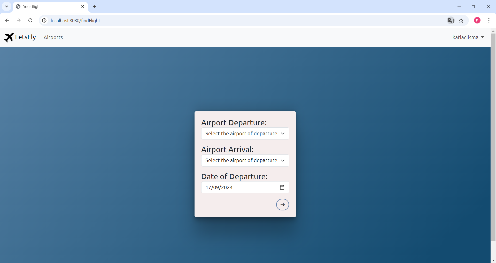
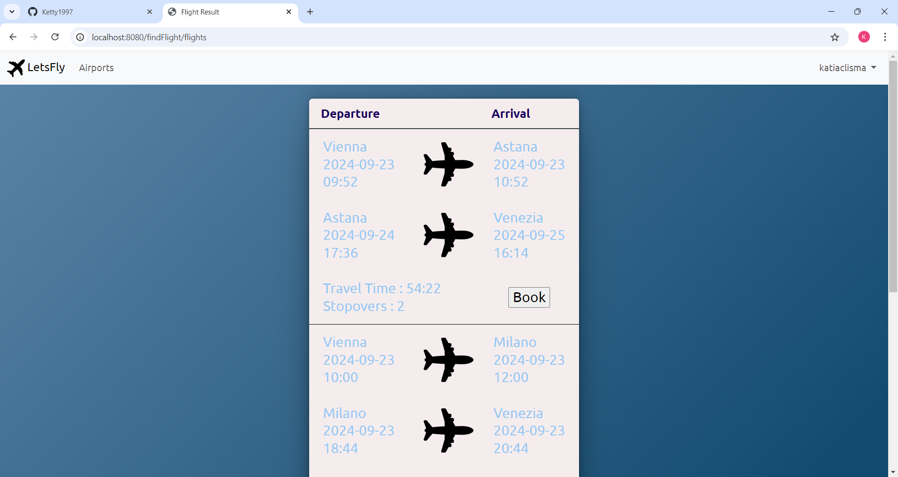
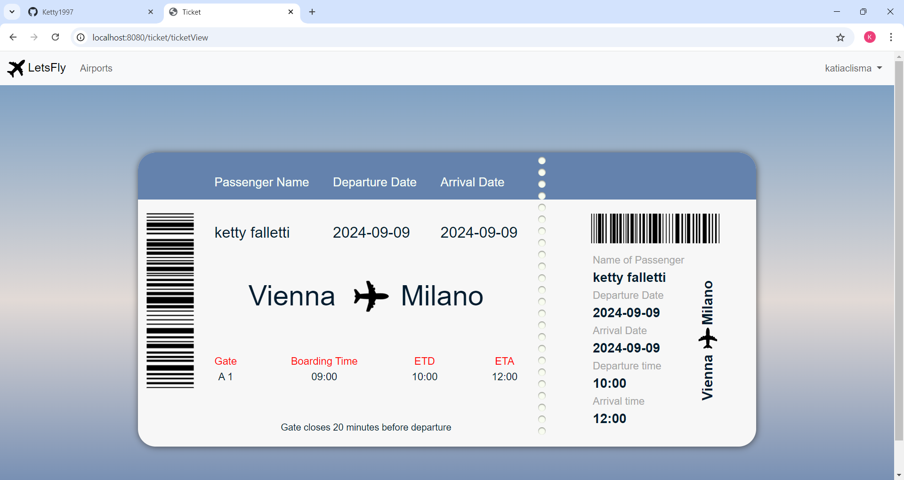
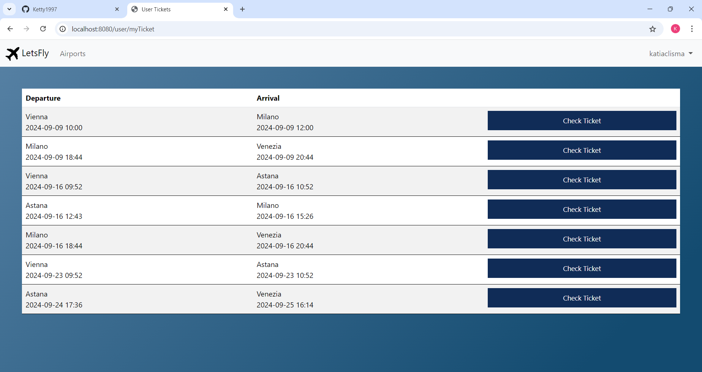
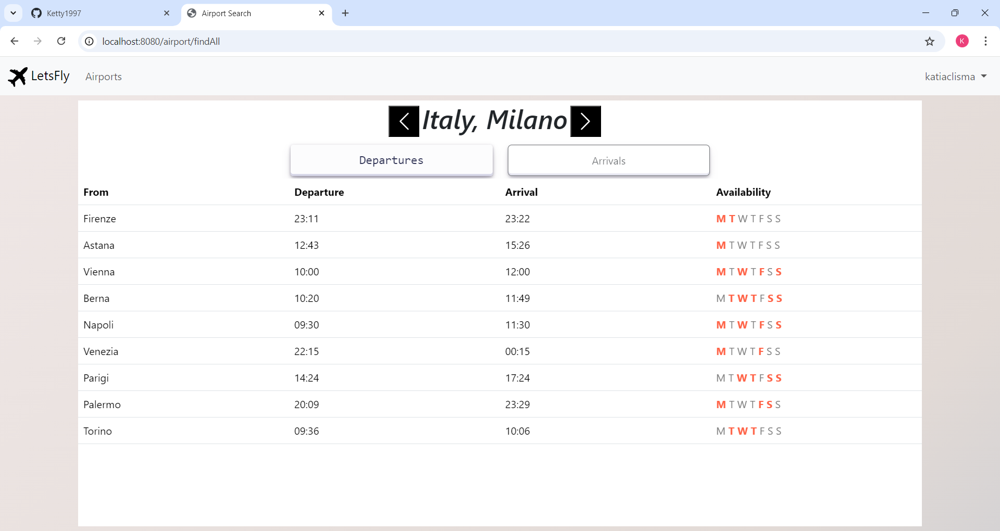
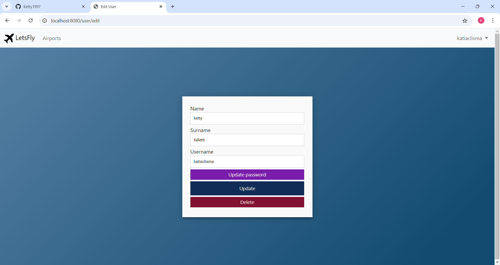
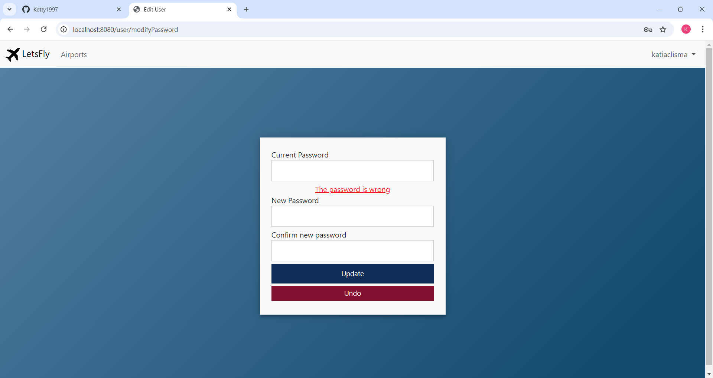
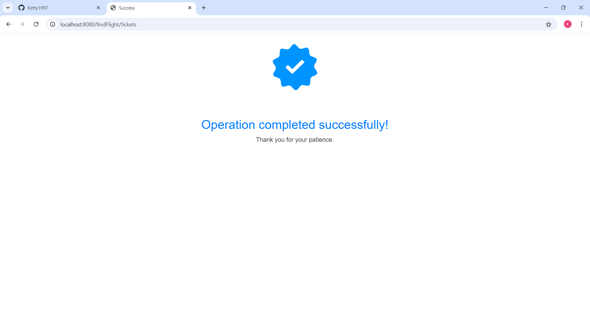

## Funzionalità

La web app include le seguenti funzionalità:

- Home page animata
- Possibilità di scegliere una città di arrivo e partenza e prenotare un volo
- generatore biglietto dinamico
- generatore voli disponibili dinamico
- Aereoporti disponibli
- home lato utente

## Tecnologie utilizzate

Il sito è stato sviluppato utilizzando le seguenti tecnologie:

- Spring
- Jpa
- Java
- HTML
- CSS
- JavaScript
- Bootstrap

## Licenza

<!-- Questo progetto è stato rilasciato sotto la licenza MIT. Per ulteriori informazioni, leggere il file `LICENSE.md`. -->

## Crediti

Questo progetto è stato sviluppato da Katia Falletti.(https://it.linkedin.com/in/katia-falletti-616890225?trk=people-guest_people_search-card)
